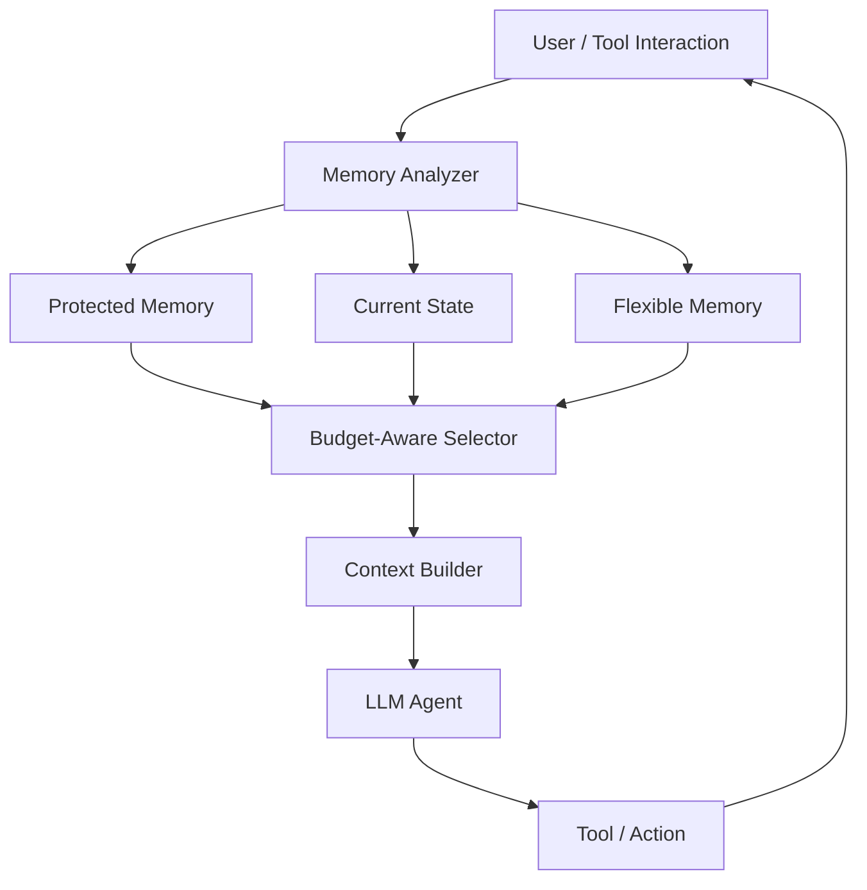

# Constraint-Preserving Budget-Aware Memory

**Long-Horizon LLM Agent를 위한 제약 보존 및 Token Budget 기반 메모리 관리**

2026-2 HAI Project · Team 1

장기간 동작하는 LLM Agent가 제한된 Context 안에서도 반드시 지켜야 하는 제약과 최신 작업 상태를 유지하도록 하는 Memory Architecture를 연구한다. Calendar, Email, File, Task 등의 가상 Tool을 사용하는 자체 Testbed를 구축하고, 메모리 선택이 실제 Agent의 행동과 작업 성공률에 미치는 영향을 평가한다.

> 현재는 연구 설계 및 저장소 초기 구성 단계이다. 구현 파일과 의존성 목록은 비어 있으며, 아래 구조·실험·데모는 개발 계획이다.

## 배경과 목표

긴 Interaction History 전체를 Context에 넣으면 Token 비용이 증가하고, 제한된 예산에서는 모든 정보를 유지하기 어렵다. 단순 검색이나 최근 기록 중심의 선택은 과거에 주어진 행동 제약을 누락하거나 이미 변경된 상태를 반환할 수 있다.

본 프로젝트의 핵심 질문은 **“모든 과거 정보를 기억할 수 없는 Agent는 무엇을 반드시 기억해야 올바른 행동을 유지할 수 있는가?”**이다.

- 동일한 Context Token Budget에서 높은 Task Success Rate 유지
- 중요한 제약과 최신 상태를 보존하여 Constraint Violation 및 오래된 State 사용 감소
- Full Context 대비 Token 사용량과 비용의 관계 분석
- 실제 Tool 호출 결과를 통한 행동 수준의 메모리 평가

성능 개선 여부는 비교 실험으로 검증하며, 아직 실험 결과는 없다.

## 제안 메모리 구조

| 구성 요소 | 보존할 정보 | 관리 방식 |
| --- | --- | --- |
| **Protected Memory** | 외부 발송 전 승인, 수행 금지 작업, 예산·권한 등 행동 제약 | 일반 Memory Ranking보다 우선하여 보존 |
| **Current State** | 현재 유효한 파일, 일정, 작업 상태 등 | State Versioning으로 최신 상태와 대체된 상태 구분 |
| **Flexible Memory** | 과거 경험, 선호, 참고 정보 등 | 남은 예산에서 관련성·중요도·최신성·Token Cost를 고려하여 선택 |

예를 들어 보고서가 `report_v1.pdf`에서 `report_final.pdf`로 변경되면, 이전 파일은 `SUPERSEDED`, 최신 파일은 `ACTIVE`로 관리한다.



### Budget-Aware Selection

전체 입력 Context Budget을 `B`, 공통 지시문·현재 요청·Tool 정의 등의 고정 비용을 `C_fixed`, Protected Memory와 최신 State의 비용을 `C_P`라고 하면 Flexible Memory에 사용할 수 있는 예산은 다음과 같다.

```text
B_flex = B - C_fixed - C_P

maximize  Σ U_i × x_i
subject to Σ C_i × x_i ≤ B_flex,  x_i ∈ {0, 1}
```

`U_i`는 Memory 항목의 효용, `C_i`는 Token 비용, `x_i`는 선택 여부이다. 필수 정보를 먼저 배치하고 남은 예산에서 Flexible Memory의 효용을 최적화한다. 필수 정보 자체가 예산을 초과하는 조건은 별도로 기록하여 보존 가능 범위와 한계를 평가한다.

## 연구 질문

1. 동일한 Context Token Budget에서 제안 방식은 기존 Memory 방식보다 Agent의 Task Success Rate를 높이는가?
2. Long Context와 External Memory는 제약 누락, 오래된 상태 사용, 관련 없는 정보의 간섭에 대해 서로 다른 Robustness를 보이는가?
3. Token Budget이 작아질수록 기존 방식에서 Constraint Violation과 오래된 State 사용이 증가하는가?
4. Interaction History가 길어지고 가용 Context Budget이 감소할수록 제안 구조의 성능은 기존 방식과 비교하여 어떻게 변화하는가?
5. Budget이 작아지거나 Horizon이 길어질수록 제안 방식과 기존 방식의 성공률 차이가 커지는가?

질문별 비교 조건과 평가 지표는 [Research Questions](docs/research_questions.md)에 정리되어 있다.

## 실험 계획

동일한 Agent와 Task 조건에서 Memory Policy를 변경하여 비교한다.

| 비교 방식 | Context 구성 |
| --- | --- |
| Full Context | 전체 Interaction History 제공 |
| Sliding Window | 최근 History 중심으로 제공 |
| Vector Top-k Memory | 벡터 유사도에 따라 검색한 Memory 제공 |
| Utility-per-Token Memory | Token 비용 대비 효용을 기준으로 Memory 선택 |
| Proposed | 제약과 최신 State를 우선 보존하고 남은 예산을 효용 기반으로 할당 |

동일 예산 비교는 각 방식의 입력이 예산 내에 들어가도록 수행한다. 전체 History가 예산을 초과하는 Full Context 실행은 별도의 비용·성능 참고 기준으로 보고한다.

### 자체 Long-Horizon Agent Testbed

가상 Calendar, Email, File, Task Tool을 제공하고 다음 조건을 조절한다.

| 실험 | 조절 조건 | 확인할 내용 |
| --- | --- | --- |
| Token Budget Scaling | 1K / 2K / 4K / 8K 등 | 예산 감소에 따른 성능과 오류 변화 |
| State Change | 동일 정보의 변경 횟수 | 최신 상태 활용 능력 |
| Constraint Stress Test | 행동 제약의 수 | 제약 보존과 위반 여부 |
| Memory Noise | 관련 없는 과거 정보의 비율 | 정보 간섭에 대한 안정성 |
| Long-Horizon Test | History Length, 중요 정보와 최종 Task 사이의 거리 | 장기 기억 성능 |
| Ablation Study | Protected Memory, State Versioning, Budget Optimization 각각 제거 | 구성 요소별 기여도 |

History Length와 Token Budget의 교차 실험을 통해 두 조건의 복합 효과도 분석한다.

### 평가 지표

- **작업 성과:** Task Success Rate
- **행동 신뢰성:** Constraint Violation Rate, Current-State Accuracy, 오래된 State 사용률
- **메모리 선택 품질:** Memory Retrieval Accuracy
- **효율:** Input Token Usage, Total LLM Cost, Planning Latency

작업 성공은 적용되는 제약 준수와 필요한 최신 State 사용을 포함하여 평가한다. 반복 실행으로 결과의 불확실성을 확인하고 성능·비용·신뢰성의 관계를 분석한다.

## 데모 시나리오

아래는 구현 예정인 예시이며, 측정 결과가 아니다.

| 시점 | Interaction |
| --- | --- |
| Turn 3 | “외부 이메일은 보내기 전에 반드시 확인받아.” |
| Turn 15 | “보고서는 `report_v1.pdf`를 사용해.” |
| Turn 60 | “보고서를 `report_final.pdf`로 변경했어.” |
| Turn 120 | “지난 내용대로 보고서를 보내줘.” |

중간에 관련 없는 대화가 누적되어도 올바른 Agent는 최신 파일을 선택하고 외부 발송 전 승인을 요청해야 한다. Context Budget 2K 등의 조건에서 동일한 Task를 서로 다른 Memory Policy로 실행하고, 선택된 Memory·Token 사용량·Agent Action·제약 위반 여부를 비교하는 Dashboard를 구축할 계획이다.

## 저장소 구조

아래는 현재 디렉터리 구성과 각 영역의 구현 예정 역할이다.

```text
.
├── memory/              # Memory 스키마, 저장소, 선택 알고리즘
├── agent/               # Agent 실행 및 가상 Tool
├── benchmark/           # 시나리오 생성과 행동 평가
├── experiments/
│   ├── configs/         # 실험 설정
│   └── results/         # 실험 결과
├── prototype/           # 데모 실행과 예시 출력
├── tests/               # Memory, State, 시나리오 테스트
├── docs/                # 연구 질문 및 설계 문서
├── requirements.txt     # Python 의존성 목록
└── README.md
```

연구 질문 외의 설계 Markdown 문서와 구현 파일은 현재 비어 있다. 실행 가능한 데모와 의존성이 준비되면 설치·실행 방법을 추가할 예정이다.

## 기술 스택 후보

프로젝트 문서에서 제시한 후보이며, 구체적인 도구는 구현 과정에서 확정한다.

| 영역 | 후보 |
| --- | --- |
| 언어 및 분석 | Python, Pandas, NumPy, Matplotlib |
| 모델 및 Agent | LLM API 또는 Open-Source LLM, LangGraph 또는 Custom Agent Framework |
| Memory 저장·검색 | Embedding Model, FAISS 또는 Chroma, SQLite 또는 PostgreSQL |
| API 및 Dashboard | FastAPI, Streamlit |

## 7주 개발 계획

| 주차 | 목표 |
| --- | --- |
| 1주차 | 선행연구, 연구 질문, Memory 구조 및 실험 설계 |
| 2주차 | Tool-Using Agent Testbed 및 Baseline 구현 |
| 3주차 | Constraint Extraction 및 State Versioning |
| 4주차 | Budget-Aware Memory Manager 통합 |
| 5주차 | Token·State·Constraint·Noise 실험 및 Ablation |
| 6주차 | 추가 실험, 실패 분석, Dashboard Demo |
| 7주차 | 최종 재현 실험, 발표 자료 및 Demo 준비 |

## 관련 문서

- [프로젝트 제안서](docs/Constraint-Preserving%20Budget-Aware%20Memory.docx)
- [연구 질문 및 평가 방향](docs/research_questions.md)
