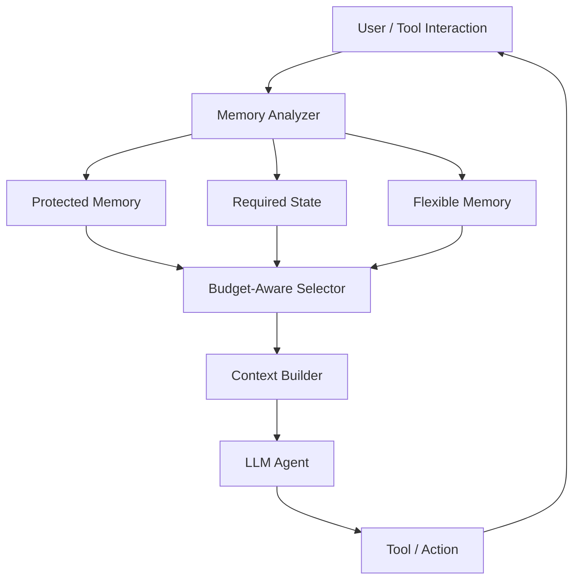

# Constraint-Preserving Budget-Aware Memory

**Long-Horizon LLM Agent를 위한 제약 보존 및 Token Budget 기반 메모리 관리**

2026-2 HAI Project · Team 1

장기간 동작하는 LLM Agent가 제한된 Context 안에서도 반드시 지켜야 하는 제약과 현재 Task에 필요한 상태를 유지하도록 하는 Memory Architecture를 연구한다. Calendar, Email, File, Task 등의 가상 Tool을 사용하는 자체 Testbed를 구축하고, 메모리 선택이 실제 Agent의 행동과 작업 성공률에 미치는 영향을 평가한다.

> 현재는 연구 설계와 V1 인터페이스 검증 단계이다. Agent 실행 흐름, mock Tool, Evaluator와 시나리오 데모가 구현되어 있으며, Memory Store와 검색·선택 핵심 알고리즘 및 실제 LLM 연동은 아직 스켈레톤이다.

## 배경과 목표

긴 Interaction History 전체를 Context에 넣으면 Token 비용이 증가하고, 제한된 예산에서는 모든 정보를 유지하기 어렵다. 단순 검색이나 최근 기록 중심의 선택은 과거에 주어진 행동 제약을 누락하거나 이미 변경된 상태를 반환할 수 있다.

본 프로젝트의 핵심 질문은 **“모든 과거 정보를 기억할 수 없는 Agent는 무엇을 반드시 기억해야 올바른 행동을 유지할 수 있는가?”**이다.

- 동일한 Context Token Budget에서 높은 Task Success Rate 유지
- 중요한 제약과 Task가 요구한 시점의 상태를 보존하여 Constraint Violation 및 오래된 State 사용 감소
- Full Context 대비 Token 사용량과 비용의 관계 분석
- 실제 Tool 호출 결과를 통한 행동 수준의 메모리 평가

성능 개선 여부는 비교 실험으로 검증하며, 아직 실험 결과는 없다.

## 제안 메모리 구조

| 구성 요소 | 보존할 정보 | 관리 방식 |
| --- | --- | --- |
| **Protected Memory** | 외부 발송 전 승인, 수행 금지 작업, 예산·권한 등 행동 제약 | 일반 Memory Ranking보다 우선하여 보존 |
| **Required State** | Task가 요구하는 시점에 유효한 파일, 일정, 작업 상태 등 | Version-Aware State Resolution으로 현재·과거 버전 선택 |
| **Flexible Memory** | 과거 경험, 선호, 참고 정보 등 | 남은 예산에서 관련성·중요도·최신성·Token Cost를 고려하여 선택 |

예를 들어 보고서가 `report_v1.pdf`에서 `report_final.pdf`로 변경되면, 이전 파일은 `SUPERSEDED`, 최신 파일은 `ACTIVE`로 관리한다.


```mermaid
flowchart TD
    A[User / Tool Interaction] --> B[Memory Analyzer]
    B --> C[Protected Memory]
    B --> D[Required State]
    B --> E[Flexible Memory]
    C --> F[Budget-Aware Selector]
    D --> F
    E --> F
    F --> G[Context Builder]
    G --> H[LLM Agent]
    H --> I[Tool / Action]
    I --> A
```

### Budget-Aware Selection

전체 입력 Context Budget을 `B`, 공통 지시문·현재 요청·Tool 정의 등의 고정 비용을 `C_fixed`, Protected Memory와 Required State의 비용을 `C_P`라고 하면 Flexible Memory에 사용할 수 있는 예산은 다음과 같다.

```text
B_flex = B - C_fixed - C_P

maximize  Σ U_i × x_i
subject to Σ C_i × x_i ≤ B_flex,  x_i ∈ {0, 1}
```

필수 정보가 예산을 넘으면 `INSUFFICIENT_CONTEXT_BUDGET`으로 중단하고 LLM과 Tool을 호출하지 않는다.

`U_i`는 Memory 항목의 효용, `C_i`는 Token 비용, `x_i`는 선택 여부이다. 필수 정보를 먼저 배치하고 남은 예산에서 Flexible Memory의 효용을 최적화한다. 필수 정보 자체가 예산을 초과하는 조건은 별도로 기록하여 보존 가능 범위와 한계를 평가한다.

## 연구 질문

1. **RQ1:** 동일한 Context Token Budget에서 Proposed가 기존 기억 방식보다 실제 Tool 행동을 포함한 작업 성공률(Action-Level TSR)을 높이는가?
2. **RQ2:** Budget이 감소하거나 중요한 정보와 Task 사이의 거리(Horizon)가 증가할 때 Proposed가 제약 위반과 잘못된 State 사용을 더 잘 억제하는가?

기준 문서는 [Research Questions](docs/research_questions.md)이다. 현재 Task에 필요한 State는 항상 최신 버전을 뜻하지 않는다. Historical Query에서는 요청 시점에 유효했던 과거 버전이 정답이다.

## 실험 계획

동일한 Agent와 Task 조건에서 Memory Policy를 변경하여 비교한다.

| 비교 방식 | Context 구성 |
| --- | --- |
| Full Context | 전체 Interaction History 제공 |
| Sliding Window | 최근 History 중심으로 제공 |
| Vector Top-k Memory | 벡터 유사도에 따라 검색한 Memory 제공 |
| Utility-per-Token Memory | Token 비용 대비 효용을 기준으로 Memory 선택 |
| Proposed | 제약과 Required State를 우선 보존하고 남은 예산을 효용 기반으로 할당 |

동일 예산 비교는 각 방식의 입력이 예산 내에 들어가도록 수행한다. 전체 History가 예산을 초과하는 Full Context 실행은 별도의 비용·성능 참고 기준으로 보고한다.

### 자체 Long-Horizon Agent Testbed

가상 Calendar, Email, File, Task Tool을 제공하고 다음 조건을 조절한다.

| 실험 | 조절 조건 | 확인할 내용 |
| --- | --- | --- |
| Token Budget Scaling | 1K / 2K / 4K / 8K 등 | 예산 감소에 따른 성능과 오류 변화 |
| State Change | 동일 정보의 변경 횟수 | 최신 상태 활용 능력 |
| Constraint Stress Test | 행동 제약의 수 | 제약 보존과 위반 여부 |
| Memory Noise | 관련 없는 과거 정보의 비율 | 정보 간섭에 대한 안정성 |
| Long-Horizon Test | History Length, 중요 정보와 최종 Task 사이의 거리 | 장기 기억 성능 |
| Ablation Study | Protected Memory, State Versioning, Budget Optimization 각각 제거 | 구성 요소별 기여도 |

History Length와 Token Budget의 교차 실험을 통해 두 조건의 복합 효과도 분석한다.

### 평가 지표

- **작업 성과:** Action-Level Task Success Rate
- **행동 신뢰성:** Constraint Violation Rate, Required-State Accuracy, 오래된 State 사용률
- **메모리 선택 품질:** Memory Retrieval Accuracy
- **효율:** Input Token Usage, Total LLM Cost, Planning Latency

작업 성공은 적용되는 제약 준수와 Task가 요구하는 시점·버전의 State 사용을 포함하여 평가한다. 반복 실행으로 결과의 불확실성을 확인하고 성능·비용·신뢰성의 관계를 분석한다.

## 데모 시나리오

아래는 데모에 구현된 예시이며, 연구 실험의 측정 결과는 아니다.

| 시점 | Interaction |
| --- | --- |
| Turn 3 | “외부 이메일은 보내기 전에 반드시 확인받아.” |
| Turn 15 | “보고서는 `report_v1.pdf`를 사용해.” |
| Turn 60 | “보고서를 `report_final.pdf`로 변경했어.” |
| Turn 120 | “지난 내용대로 보고서를 보내줘.” |

중간에 관련 없는 대화가 누적되어도 올바른 Agent는 최신 파일을 선택하고 외부 발송 전 승인을 요청해야 한다. Context Budget 2K 등의 조건에서 동일한 Task를 서로 다른 Memory Policy로 실행하고, 선택된 Memory·Token 사용량·Agent Action·제약 위반 여부를 비교하는 Dashboard를 구축할 계획이다.

## 저장소 구조

아래는 현재 디렉터리 구성과 각 영역의 역할이다.

```text
.
├── memory/              # Memory 스키마, 저장소, 선택 알고리즘
├── agent/               # Agent 실행 및 가상 Tool
├── benchmark/           # 시나리오 생성과 행동 평가
├── experiments/
│   ├── configs/         # 실험 설정
│   └── results/         # 실험 결과
├── prototype/           # 데모 실행과 예시 출력
├── tests/               # Memory, State, 시나리오 테스트
├── docs/                # 연구 질문 및 설계 문서
├── requirements.txt     # Python 의존성 목록
└── README.md
```

Agent 스켈레톤과 mock Tool 데모는 저장소 루트에서 다음으로 실행한다.

```text
python prototype/run_demo.py
```

데모는 스크립트 planner로 파일 선택, 승인 요청, 발송 순서를 확인하고, 예산이 고정 입력보다 작으면 툴을 호출하지 않는지 확인한다. 이어서 `benchmark/scenarios.json`을 읽는다. 기억 선택은 아직 미구현인 선택기 함수를 데모 내부의 결정적 구현으로 대체하여 시나리오 `memory_snapshot`과 합성 토큰 수로 실행한다. 에이전트는 예산 중단, 기억 문장 답변, 기대 툴 호출을 수행한 뒤 evaluator에 넘긴다. `python prototype/run_demo.py S01`처럼 시나리오 ID를 지정하거나 `--all`, `--list`를 쓸 수 있다. 실제 LLM은 아직 연결되지 않았다.

## 기술 스택 후보

프로젝트 문서에서 제시한 후보이며, 구체적인 도구는 구현 과정에서 확정한다.

| 영역 | 후보 |
| --- | --- |
| 언어 및 분석 | Python, Pandas, NumPy, Matplotlib |
| 모델 및 Agent | LLM API 또는 Open-Source LLM, LangGraph 또는 Custom Agent Framework |
| Memory 저장·검색 | Embedding Model, FAISS 또는 Chroma, SQLite 또는 PostgreSQL |
| API 및 Dashboard | FastAPI, Streamlit |

## 7주 개발 계획

| 주차 | 목표 |
| --- | --- |
| 1주차 | 선행연구, 연구 질문, Memory 구조 및 실험 설계 |
| 2주차 | Tool-Using Agent Testbed 및 Baseline 구현 |
| 3주차 | Constraint Extraction 및 State Versioning |
| 4주차 | Budget-Aware Memory Manager 통합 |
| 5주차 | 필수 RQ1/RQ2 Budget × Horizon 실험 |
| 6주차 | 실패 분석, 여유가 있으면 Ablation·stress, Dashboard Demo |
| 7주차 | 최종 재현 실험, 발표 자료 및 Demo 준비 |

## 관련 문서

- [프로젝트 제안서](docs/Constraint-Preserving%20Budget-Aware%20Memory.docx)
- [연구 질문 및 평가 방향](docs/research_questions.md)
