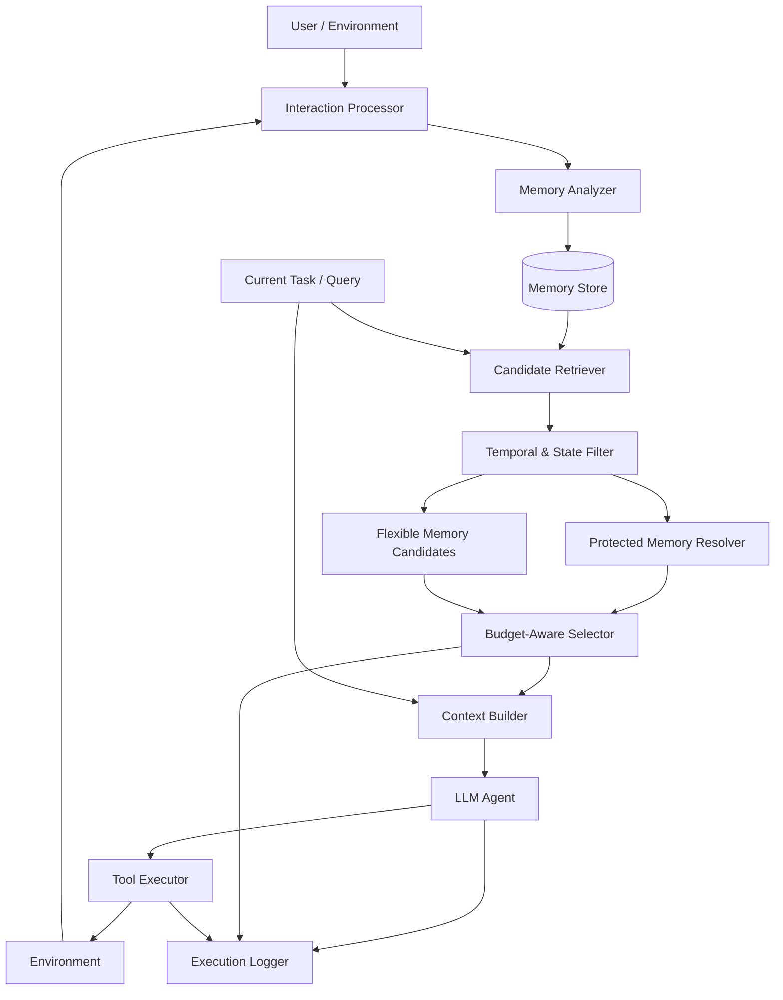

# System Architecture

## 1. Overview

본 프로젝트는 Long-Horizon LLM Agent가 제한된 Context Token Budget에서도 **행동에 필수적인 Constraint와 최신 State를 보존하면서 필요한 Memory를 선택할 수 있도록 하는 Memory Architecture**를 구현한다.

전체 시스템은 크게 다음 파이프라인으로 구성된다.

```text
User / Tool Interaction
        ↓
Memory Analyzer
        ↓
Memory Store
        ↓
Candidate Retrieval
        ↓
Temporal / State Filtering
        ↓
Constraint-Preserving
Budget-Aware Selector
        ↓
Context Builder
        ↓
LLM Agent
        ↓
Tool Executor
        ↓
Environment / New Interaction
```

핵심은 단순히 관련성이 높은 Memory를 검색하는 것이 아니라,

1. 현재 Task와 관련된 Memory를 찾고
2. 오래되었거나 대체된 State를 제거하고
3. 반드시 지켜야 하는 Constraint를 우선 보존한 뒤
4. 남은 Token Budget에 Flexible Memory를 배치하는 것

이다.

---

# 2. Design Principles

## 2.1 Memory Type과 Selection Policy의 분리

Memory의 의미와 보존 정책을 분리한다.

```text
memory_type
= 정보가 무엇인가?

is_protected
= Context 선택 시 우선 보존해야 하는가?
```

예:

```text
memory_type = constraint
is_protected = true

memory_type = preference
is_protected = false
```

---

## 2.2 State Versioning & Temporal Validity

동일한 State가 변경되면 이전 정보를 삭제하지 않고 Version History로 유지한다.

```text
report.current_file

report_v1.pdf
SUPERSEDED (is_active = false)

        ↓

report_final.pdf
ACTIVE (is_active = true)
```

단, SUPERSEDED는 더 이상 현재 상태가 아니라는 의미이지, 검색 대상에서 완전히 제거한다는 의미가 아니다.

현재 상태를 요구하는 Query에서는 ACTIVE State를 우선 사용하지만, 과거 특정 시점을 요구하는 Historical Query에서는 해당 시점에 유효했던 SUPERSEDED State가 정답이 될 수 있다.

예:

```text
현재 보고서 보내줘
→ report_final.pdf

8월에 사용하던 보고서 보내줘
→ 8월 당시 유효했던 과거 State
```

따라서 State는 현재 유효성뿐 아니라 시간적 유효 구간(Temporal Validity)도 함께 관리한다.

---

## 2.3 Storage와 Context의 분리

Memory Store에 저장된 정보 전체를 LLM에게 전달하지 않는다.

```text
Memory Store
= 장기 저장 공간

LLM Context
= 현재 Task에 필요한 Memory만 선택된 공간
```

따라서 Timestamp, Entity Metadata 등 검색에 필요한 정보는 저장하되, 최종 Prompt에는 필요한 정보만 포함한다.

---

## 2.4 Retrieval과 Preservation의 분리

관련성 검색 결과가 곧 최종 Context는 아니다.

```text
Retrieval
↓
Candidate Memory 생성

Filtering / Preservation / Budget Allocation
↓
Final Context 생성
```

특히 Protected Memory는 일반 relevance ranking만으로 제거되어서는 안 된다.

---

# 3. High-Level Architecture



---

# 4. Main Components

## 4.1 Interaction Processor

사용자 메시지와 Tool 실행 결과를 공통 Interaction 형식으로 변환한다.

### Input

```text
User Message
Tool Result
Environment Observation
```

### Output

```python
Interaction(
    session_id,
    turn_id,
    content,
    source,
    timestamp
)
```

이 Interaction이 Memory Analyzer의 입력이 된다.

---

# 4.2 Memory Analyzer

Interaction에서 장기적으로 저장할 가치가 있는 정보를 추출한다.

주요 역할:

```text
Memory Extraction
Memory Type Classification
Protection 판단
State Key 추출
Importance 추정
Entity 추출
```

예:

```text
Input

"외부 이메일은 보내기 전에 반드시 나한테 확인받아."
```

↓

```text
memory_type = constraint
memory_key = email.external.requires_approval
is_protected = true
```

또 다른 예:

```text
"앞으로 report_final.pdf를 사용해."
```

↓

```text
memory_type = state
memory_key = report.current_file
is_protected = false
```

Analyzer 구현 초기에는 **LLM Structured Output + Rule-based Validation** 방식을 사용한다.

---

# 4.3 Memory Store

Memory를 장기적으로 저장하고 Version History 및 Temporal Validity를 관리한다.

Memory 기본 구조:

```python
MemoryItem(
    memory_id,
    session_id,
    turn_id,

    memory_type,
    memory_key,
    content,

    is_active,
    is_protected,

    importance,
    token_count,

    created_at,
    valid_from,
    valid_to,

    supersedes,
    superseded_by
)
```

시간 관련 필드의 역할은 다음과 같다.

```text
created_at
→ Memory가 생성된 시점

valid_from
→ 해당 정보가 유효하기 시작한 시점

valid_to
→ 해당 정보가 더 이상 유효하지 않게 된 시점
```

현재 유효한 State는 일반적으로:

```text
valid_to = null
is_active = true
```

이며, 새로운 State에 의해 대체되면 기존 State의 valid_to가 설정되고 SUPERSEDED 상태가 된다.

Timestamp는 단순 Recency 점수뿐 아니라 Historical Query에서 특정 시점에 유효했던 Memory Version을 복원하기 위해 사용한다.

---

## Memory Types

```text
constraint
state
preference
fact
experience
```

### Constraint

Agent 행동에 적용되는 규칙.

```text
외부 이메일은 사용자 승인 후 발송한다.
```

### State

현재 유효한 작업 상태.

```text
현재 사용할 보고서는 report_final.pdf이다.
```

### Preference

사용자의 선호 정보.

```text
사용자는 Python을 선호한다.
```

### Fact

비교적 안정적인 사실 정보.

```text
프로젝트 마감일은 11월 20일이다.
```

### Experience

Agent가 과거 Task에서 얻은 경험.

```text
이 API는 rate limit이 자주 발생한다.
```

---

# 5. State Versioning

새로운 Memory가 기존 Memory를 대체하는 경우 Store가 Version Chain과 유효 시간 구간을 관리한다.

예:

```text
2026-06-01
report.current_file = report_v1.pdf

2026-08-15
report.current_file = report_v2.pdf

2026-09-20
report.current_file = report_final.pdf
```

저장 결과:

```text
mem_010

content = report_v1.pdf
status = SUPERSEDED

valid_from = 2026-06-01
valid_to   = 2026-08-15

superseded_by = mem_030


mem_030

content = report_v2.pdf
status = SUPERSEDED

valid_from = 2026-08-15
valid_to   = 2026-09-20

supersedes    = mem_010
superseded_by = mem_050

mem_050

content = report_final.pdf
status = ACTIVE

valid_from = 2026-09-20
valid_to   = null

supersedes = mem_030
```

Store는 다음 invariant를 유지한다.

```text
동일 memory_key에서 현재 ACTIVE Memory는 최대 1개

ACTIVE State는 현재 시점에서 유효한 Version을 의미

SUPERSEDED State도 Historical Query를 위해 보존

각 Version은 자신의 valid_from / valid_to를 가짐

Version Chain에는 cycle이 존재하지 않음

supersedes / superseded_by는 동일 Session 내 Memory를 참조
```

---

# 6. Candidate Retrieval

현재 Task와 관련된 Memory 후보를 검색한다.

단일 Vector Similarity보다 다양한 Retrieval Signal을 사용할 수 있도록 한다.

```text
Semantic Similarity
Keyword / BM25
Entity Match
Temporal Signal
```

전체 흐름:

```text
Current Query
   ↓
Semantic Retrieval ─┐
BM25 Retrieval ─────┤
Entity Retrieval ───┤
                    ↓
              Candidate Pool
```

각 Memory에 대해 요청 시점에 Retrieval Score를 계산한다.

```text
semantic_score
keyword_score
entity_score
```

이 값들은 Memory 자체에 영구 저장하지 않고 **현재 Query에 대한 Candidate 정보**로 관리한다.

---

# 7. Temporal Intent Detection & Version-Aware Filtering

현재 Query가 요구하는 시간적 기준을 먼저 파악한 뒤 적절한 Memory Version을 선택한다.

## 7.1 Temporal Intent Detection

Query를 크게 다음과 같이 구분한다.

```text
CURRENT
→ 현재 상태를 요구

HISTORICAL
→ 특정 과거 시점의 상태를 요구

RELATIVE_TIME
→ 현재 시점을 기준으로 상대적인 과거를 요구

UNSPECIFIED
→ 명시적인 시간 조건 없음
```

예:

```text
"현재 보고서 뭐야?"
→ CURRENT

"8월에 사용하던 보고서 뭐야?"
→ HISTORICAL

"두 달 전에 쓰던 파일 보내줘."
→ RELATIVE_TIME
```

Temporal 표현은 가능한 경우 실제 시간 범위 또는 Target Time으로 변환한다.

```text
"2026년 8월"
→ 2026-08-01 ~ 2026-08-31

"두 달 전"
→ Current Time 기준 Target Time 계산
```

## 7.2 Version-Aware State Resolution

Query의 Temporal Intent에 따라 State Version을 다르게 선택한다.

### Current Query

```text
ACTIVE State 우선
SUPERSEDED State는 기본적으로 제외
```

예:

```text
"현재 보고서 보내줘."
→ report_final.pdf
```

### Historical Query

ACTIVE / SUPERSEDED 여부가 아니라 Target Time에 실제로 유효했는지를 기준으로 선택한다.

기본 조건:

```text
valid_from <= target_time

AND

valid_to > target_time
OR
valid_to is null
```

예:

```text
Query:
"8월 20일에 사용하던 보고서 보내줘."

State History:

v1: 06-01 ~ 08-15
v2: 08-15 ~ 09-20
final: 09-20 ~

Result:
report_v2.pdf
```

따라서 SUPERSEDED Memory도 Historical Query에서는 정상적인 정답 후보가 될 수 있다.

## 7.3 Temporal Signal for Flexible Memory

State Version Resolution과 별도로 Flexible Memory에서는 Timestamp 또는 Turn Distance를 Utility 계산에 사용할 수 있다.

예:

```text
Temporal Distance
=
current_turn - memory.turn_id
```

또는 실제 Timestamp 차이를 사용할 수 있다.

```text
Recency
=
f(current_time - created_at)
```

단, Recency는 Flexible Memory의 Ranking Signal이며, State의 올바른 Version을 결정하는 기준과는 구분한다.

또한 Protected Constraint는 단순히 오래되었다는 이유만으로 제거하지 않는다.

---

# 8. Protected Memory Resolver

현재 Task와 요구된 시점에 적용되는 Protected Memory를 식별한다.

중요한 점은:

```text
is_protected = true

≠

모든 Task에서 항상 Context에 삽입
```

이라는 것이다.

예:

```text
2026-06-01
"외부 이메일은 반드시 승인 후 보내."

2026-09-01
"앞으로는 외부 이메일도 승인 없이 보내도 돼."
```

현재 이메일을 보내는 Task라면 최신 Constraint를 사용해야 한다.

반대로 사용자가:

```text
"6월 당시 규칙대로 처리했다면 어떤 행동을 했어야 해?"
```

라고 요청한다면 과거 시점에 유효했던 Constraint Version이 필요할 수 있다.

따라서 Protected Memory 역시 필요한 경우 Temporal Validity를 고려하여 적용 가능성을 판단한다.

---

# 9. Budget-Aware Selector

본 프로젝트의 핵심 모듈이다.

전체 Context Budget을 다음과 같이 정의한다.

```text
B_total
```

먼저 공통 입력 비용을 제외한다.

```text
B_memory
=
B_total
- System Prompt
- Tool Definition
- Current Query
```

그다음 Protected Memory와 필요한 Current State를 우선 할당한다.

```text
B_flexible
=
B_memory
- C_protected
- C_state
```

남은 Budget에서 Flexible Memory를 선택한다.

---

## Flexible Memory Utility

각 Memory의 Utility는 예를 들어 다음 요소로 구성한다.

```text
Relevance
Importance
Recency
Entity Match
```

개념적으로:

```text
U_i =
α · Relevance_i
+ β · Importance_i
+ γ · Recency_i
+ δ · EntityMatch_i
```

최종 선택 문제:

```text
maximize Σ U_i × x_i

subject to

Σ token_i × x_i ≤ B_flexible

x_i ∈ {0, 1}
```

초기 구현에서는 다음 두 방식을 비교할 수 있다.

```text
Greedy Utility-per-Token

vs

0/1 Knapsack
```

---

# 10. Context Builder

Selector 결과를 실제 LLM Prompt 형태로 변환한다.

권장 Context 구조:

```text
[SYSTEM]

...

[PROTECTED CONSTRAINTS]

- 외부 이메일은 승인 후 발송해야 한다.

[CURRENT STATE]

- Current report: report_final.pdf

[RELEVANT MEMORY]

- 사용자는 간결한 이메일을 선호한다.

[CURRENT TASK]

최신 보고서를 교수님께 보내줘.
```

Context Builder는 다음을 기록한다.

```text
selected_memory_ids
total_memory_tokens
protected_tokens
state_tokens
flexible_tokens
unused_budget
```

이 정보는 이후 실험에 사용된다.

---

# 11. LLM Agent

LLM Agent는 제공된 Context를 기반으로 Task를 계획하고 Tool을 호출한다.

예:

```text
Context

Protected:
외부 이메일은 승인 후 발송한다.

State:
report.current_file = report_final.pdf

Task:
교수님께 최신 보고서를 보내줘.
```

Agent Action:

```text
select_file("report_final.pdf")

draft_email(...)

request_approval()
```

잘못된 Action:

```text
send_email()
```

은 Constraint Violation으로 기록한다.

---

# 12. Tool Executor

Agent가 생성한 Tool Call을 실제 또는 Mock Environment에서 실행한다.

초기 Testbed에서는 가상 Tool을 사용한다.

```text
Email
Calendar
File
Task
```

예:

```python
draft_email()

send_email()

request_approval()

find_file()

create_event()

update_task()
```

Tool 실행 결과는 다시 Interaction으로 변환되어 Memory Pipeline으로 들어간다.

---

# 13. Execution Logger

각 Agent 실행에서 다음 정보를 기록한다.

```text
Query

Retrieved Candidates

Selected Memories

Rejected Memories

Protected Memories

Token Usage

LLM Input

Tool Calls

Task Result

Constraint Violation

Stale State Usage

Latency

Cost
```

예:

```json
{
  "task_id": "task_032",
  "policy": "proposed",
  "token_budget": 2048,

  "selected_memory_ids": [
    "mem_003",
    "mem_060"
  ],

  "input_tokens": 1812,

  "task_success": true,
  "constraint_violation": false,
  "stale_state_used": false
}
```

---

# 14. End-to-End Data Flow

전체 흐름은 다음과 같다.

```text
1. User Interaction 발생

        ↓

2. Memory Analyzer가
   저장할 Memory 추출

        ↓

3. Memory Store에 저장
   State 변경 시 Versioning 및
   Temporal Validity 갱신

        ↓

4. 새로운 Task 발생

        ↓

5. Temporal Intent Detection

   CURRENT
   HISTORICAL
   RELATIVE_TIME
   UNSPECIFIED

        ↓

6. Candidate Retrieval

   Semantic
   BM25
   Entity

        ↓

7. Temporal Resolution

   Target Time / Time Range 결정

        ↓

8. Version-Aware Filtering

   현재 Query:
   ACTIVE State 우선

   Historical Query:
   해당 시점에 유효한 Version 선택

        ↓

9. Applicable Protected Memory 결정

        ↓

10. 필요한 State 확보

        ↓

11. 남은 Token Budget 계산

        ↓

12. Flexible Memory 최적화

        ↓

13. Context Builder

        ↓

14. LLM Agent Reasoning

        ↓

15. Tool Action

        ↓

16. Environment Result

        ↓

17. Evaluation / Logging

        ↓

18. 새로운 Memory 생성 가능
```

---

# 15. Baseline Architecture

동일한 Agent와 Tool Environment를 유지하면서 **Memory Policy만 변경**한다.

```text
                    ┌─ Full Context
                    │
Interaction History ├─ Sliding Window
                    │
                    ├─ Vector Top-k
                    │
                    ├─ Utility-per-Token
                    │
                    └─ Proposed
```

이를 통해 Agent 모델 자체의 차이가 아닌 **Memory Architecture의 효과**를 비교한다.

---

# 16. Long Context / External Memory Extension

본 프로젝트의 기본 구조는 External Memory 기반으로 구현한다.

추가 실험에서는 다음 구조를 비교할 수 있다.

```text
Long Context
vs
External Memory
vs
Fixed Hybrid
vs
Dynamic Hybrid
```

Dynamic Hybrid는 Query 및 History 특성에 따라 Long Context와 External Memory의 사용 비율을 동적으로 결정하는 방식이다.

단, 현재 프로젝트의 핵심 Contribution은 Dynamic Hybrid 자체가 아니라

```text
Constraint Preservation
+
State Versioning
+
Budget-Aware Memory Selection
```

으로 유지한다.

---

# 17. Repository Mapping

각 Architecture Component는 다음 파일에 대응한다.

```text
.
├── memory/
│   ├── schema.py
│   │   └── MemoryItem / Enum
│   │
│   ├── store.py
│   │   └── Storage / State Versioning
│   │
│   └── selector.py
│       └── Retrieval / Protected Resolution
│           / Budget-Aware Selection
│
├── agent/
│   ├── agent.py
│   │   └── LLM Agent
│   │
│   └── tools/
│       ├── email.py
│       ├── calendar.py
│       ├── file.py
│       └── task.py
│
├── benchmark/
│   ├── generator.py
│   │   └── Long-Horizon Scenario Generation
│   │
│   ├── evaluator.py
│   │   └── Task / Constraint Evaluation
│   │
│   └── scenarios.json
│
├── experiments/
│   ├── configs/
│   └── results/
│
├── prototype/
│   └── run_demo.py
│
└── docs/
    ├── architecture.md
    ├── memory_schema.md
    ├── algorithm.md
    ├── interfaces.md
    └── experiment_plan.md
```

---

# 18. Core System Invariants

구현 과정에서 다음 규칙은 반드시 유지한다.

```text
1. 동일 memory_key에서 현재 ACTIVE State는 최대 하나만 존재한다.

2. SUPERSEDED는 삭제 또는 무효 Memory를 의미하지 않는다.
   현재 상태로는 유효하지 않지만 Historical Query에서 사용될 수 있다.

3. Current Query에서는 ACTIVE State를 우선 사용한다.

4. Historical Query에서는 status가 아니라
   valid_from / valid_to를 기준으로 올바른 Version을 선택한다.

5. Query가 요구한 시점과 다른 State Version을 사용하는 경우
   Temporal / Stale-State Error로 기록한다.

6. Protected Memory는 일반 Flexible Memory보다 우선한다.

7. Protected Memory도 현재 Task 및 Target Time에
   적용 가능한 경우에만 Context에 포함한다.

8. 전체 Context는 설정된 Token Budget을 초과하지 않는다.

9. Retrieval Score와 Recency Score는 Query-dependent 값이므로
   MemoryItem에 영구적인 최종 점수로 저장하지 않는다.

10. Timestamp / Entity / Version Metadata는
    검색과 Temporal Resolution에 사용하며,
    필요하지 않으면 LLM Context에 직접 노출하지 않는다.

11. Baseline과 Proposed 방식은
    동일한 Agent / Model / Tool / Task 조건에서 비교한다.
```

## Stale-State Error 정의

단순히 SUPERSEDED Memory 사용 = 오류로 정의하지 않는다.

```text
Stale-State Error
=
Query가 요구하는 시점과 일치하지 않는
State Version을 Agent가 행동에 사용한 경우
```

예:

```text
Query:
"현재 보고서 보내줘."

report_v1.pdf 사용
→ ERROR
```

하지만

```text
Query:
"6월에 사용하던 보고서 보내줘."

report_v1.pdf 사용
→ CORRECT
```

즉 과거 Memory의 사용 자체가 오류가 아니라 시간적으로 잘못된 Memory Version의 사용을 오류로 정의한다.

---

# 19. Architecture Scope for V1

7주 프로젝트 범위를 고려하여 V1에서는 다음 기능을 우선 구현한다.

**필수**

```text
Structured Memory Store
State Versioning
Timestamp / Turn Metadata
Semantic Retrieval
Protected Memory
Budget-Aware Selection
LLM Tool Agent
Automatic Evaluation
```

**가능하면 추가**

```text
BM25 Retrieval
Entity Matching
Temporal Decay
Reranking
```

**후순위**

```text
Hierarchical Memory
Dynamic Hybrid Context
Learned Memory Selector
Graph Memory
RL-based Memory Policy
```

V1의 목표는 복잡한 Memory System을 만드는 것이 아니라,

> **제한된 Token Budget에서 Constraint와 최신 State를 우선적으로 보존하는 것이 실제 Agent 행동의 신뢰성과 효율성을 개선하는지 검증할 수 있는 최소한의 완전한 Architecture를 구현하는 것**

이다.